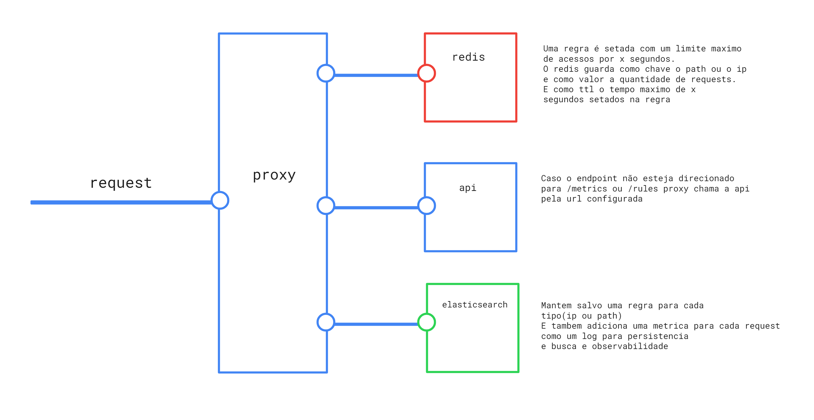

# proxy-meli
Proxy tech challenge for MELI

## Introdução
Como o guia de getting started da api do MELI já não possuia mais suporte para aplicações rodando em localhost, o proxy é api agnostico, então qualquer api rest deveria funcionar(proxy testado com duas apis httpbin.org e inshorts.deta.dev)

## Guia de uso
Criar um arquivo .env e copiar o conteudo de exemplo do env.example

### Para utilizar apenas o docker basta rodar:

Para rodar no docker: 
```
docker-compose up -d --build
```

### Para rodar localmente com node.js basta rodar o seguinte comando: 
```
docker-compose up redis elasticsearch
```

e uma vez que os bancos ja estejam de pé basta rodar: 
```
node index.js 
```

## Guia de teste

Para facilitar o teste, o projeto conta com uma coleção http que pode ser rodada no [insomnia](https://insomnia.rest/download) sob o nome de Insomnia_collection

## Sobre a arquitetura



A aplicação possui 3 dominios distintos: Rules, Metrics e Proxy

Rules é responsável por criar e remover regras de acesso como o tipo(ip ou path), o numero maximo de requests e em quanto tempo em segundos as requests podem ser resetadas, por exemplo:
  - Uma regra que permita que cada ip faça um maximo de 10 requisições por segundo

Proxy é responsavel por receber uma request e ver se determinado ip ou path atingiu o numero maximo de requests, se sim retorna um 400 informando o ocorrido, caso não adiciona em mais um o contador de requests no redis e adiciona uma metrica no elasticsearch e após isso chama a api e devolve seu resultado para o usuario

Metrics é responsavel por guardar e pesquisar o historico das requests, se a request atingiu seu maximo de requests na regra, quantas vezes determinado ip e path foram acessados etc

Tanto Rules, Proxy e Metrics podem ser configurados e acessados via api rest através dos endpoints listados na collection do insomnia

## Sobre os endpoints

- RULES
  - [POST] Criar uma regra (http://localhost:3000/rules/)
      ```
      {
	"type": "path",		
	"max_requests": 10,		
	"expiration_every": 60
	}
      ```
  - [DELETE] Remover uma regra (http://localhost:3000/rules/:type)
  
- METRICS
  -  [GET] Visualizar todas as metricas (http://localhost:3000/metrics) e para filtrar basta usar os seguintes query params:
     - Para obter os paths que atingiram o maximo de requisições ?type=path&max_requests_reached=true
     - Para obter os ips que atingiram o maximo de requisições ?type=ip&max_requests_reached=true
     - Para agrupar ordenar as requests mais acessadas por path e ip ?type=path&count_requests=true

- PROXY
  -  [ANY] Chamar um endpoint da api configurada (http://localhost:3000/)
      
## Sobre os testes unitários

Para executar os testes unitarios basta rodar
```
npm run test
```
ou para obter o coverage
```
npm run coverage
```
